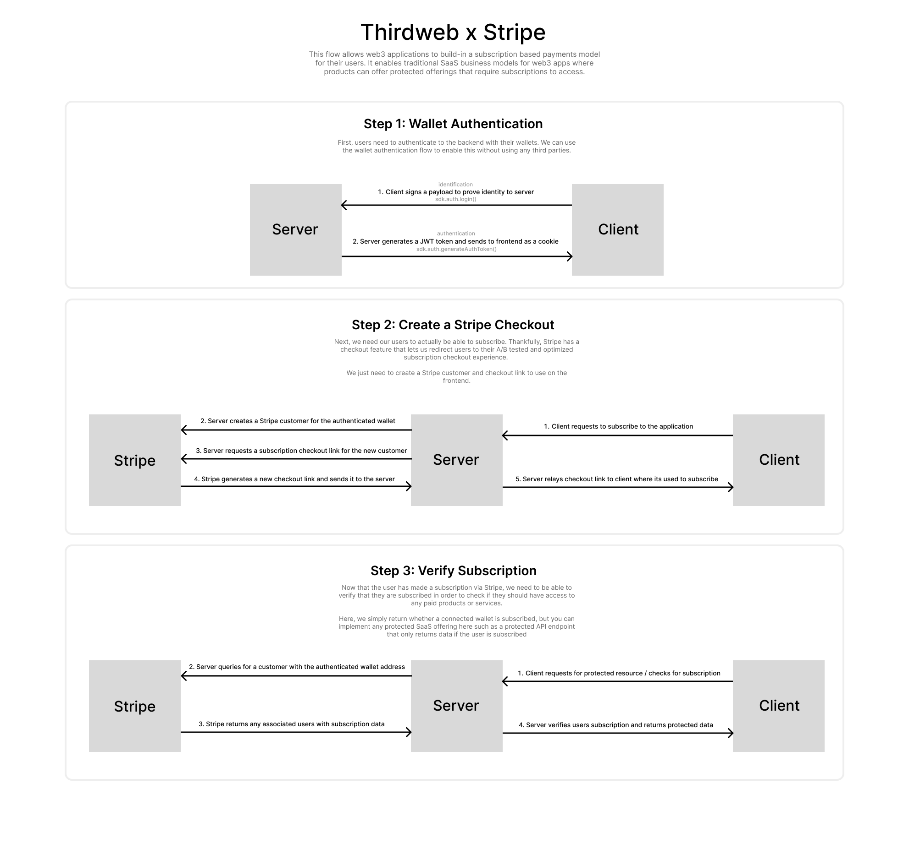

## Web3sdkio Stripe

This project demonstrates an example flow for setting up subscription based payments for web3 apps using web3sdkio [wallet authentication](https://portal.web3sdk.io/advanced-features/wallet-authentication) and [Stripe](https://stripe.com). 

It enables traditional SaaS business models for web3 apps where products can offer protected services that require subscriptions to access. 

Below is a visual breakdown and explanation of how the whole flow works:



This is an example of the power that the wallet authentication flow offers for web3 apps as it allows any web3 application to use any web2 service without any added dependency on third party services.

## Runnning the Example

In order to run this example project, we'll need to setup a few pieces. First, we'll need to store environment variables for the admin wallet to use for authentication on the backend (to learn more about how wallet authentication works, you can checkout the [Wallet Authentication Documentation](https://portal.web3sdk.io/advanced-features/wallet-authentication)). Additionally, we'll need to setup a Stripe account and configure a product on the Stripe dashboard to use for our subscription.

### Setup Web3sdkio

To run the project, first clone this repository, and then run one of the following commands to install the dependencies:

```bash
npm install
# or
yarn install
```

Next, you need to create a `.env.local` file and add the `ADMIN_PRIVATE_KEY` variable to it with the private key of the wallet you want to use as the admin wallet to generate and verify payloads. Your file should use something like the following:

```.env
ADMIN_PRIVATE_KEY=...
```

Since we are using the `web3sdkio authentication` flow, we'll also need to specify a domain in our environment variables for both our client and server sides to use. This domain should be the url of your client side application and is used to prevent phishing attacks. We can add it to the `NEXT_PUBLIC_AUTH_DOMAIN` variable in our `.env.local` file.

```.env
NEXT_PUBLIC_AUTH_DOMAIN=...
```

Finally, you can run the project with one of the following commands:

```bash
npm run dev
# or
yarn dev
```

Now, you can navigate to [http://localhost:3000](http://localhost:3000) to visit the client side page where you can connect a wallet and authenticate.

### Setup Stripe

Now that we've setup our web3sdkio app with authentication, we need to setup Stripe to handle payments.

**1. Setup Stripe Account**

The first step to setting up our payments is to create an account with [Stripe](https://stripe.com). From here, you can log in to the Stripe dashboard and find your `Stripe Secret Key` (your publishable and secret keys should be on the main page of the dashboard, and should start with `pk_test_` and `sk_test_` respectively).

You can paste the secret key into the `.env` file as well:

```.env
STRIPE_SECRET_KEY=...
NEXT_PUBLIC_STRIPE_PUBLISHABLE_KEY=...
```

**2. Setup Stripe Product**

Next, we need to setup a new product in Stripe with a default subscription price. You can do this by heading to the stripe dashboard and navigating to `Payments > Subscriptions > Create Pricing` and follow through the flow.

Now we can find the ID of our new product pricing by navigating to the `Products` tab and clicking into the newly created product, where there should be a setup price obejct with an `API ID` to copy (the ID should start with `price_`).

We can add this price ID to our `.env` file as well:

```.env
STRIPE_PRICE_ID=...
```

**3. Subscribing**

Now everything we need is setup to use our application. We can run `yarn dev` or `npm run dev` to start the application and then navigate to `localhost:3000`. From here, we can connect our wallet, login, and then click the subcribe button to subscribe to our product and go through stripes flow. Once we are redirected back to the original page, we can verify that the subscription was created successfully by clicking the check subcription button, and the subscription should also show up in the Stripe dashboard.

## Browse the Source Code

As previously mentioned, this project uses `wallet authentication` along with Stripe to enable subscriptions to web3 apps. All the important code in this project is fully documented to help you understand how it works. The following are the relevant files for each piece of the flow to help you understand everything:

- [`/pages/api/auth`](/pages/api/auth) - **Wallet Authentication** - This folder contains all the code used for authenticating a wallet to the backend. Users can login to the backend by using the `/api/auth/login` endpoint which verifies their wallet address and issues a secure cookie to the frontend which is used to authenticate the user on all future requests. Every other endpoint checks for and validates this cookie to make sure that the user is logged in.
- [`/pages/api/stripe`](/pages/api/stripe) - **Stripe Payments** - This folder contains the backend endpoints that authenticate the connected user, create a new Stripe customer with the associated wallet address, and generate a Stripe checkout link to send to the frontend, as well as the endpoint that verifies if a user is subscribed.
- [`/hooks`](/hooks) - **Frontend Hooks** - Here you'll find the frontend hooks handling the requests made to the backend for authentication and for using Stripe checkout.

### Learn More

To learn more about web3sdkio and Next.js, take a look at the following resources:

- [web3sdkio Wallet Authentication](https://portal.web3sdk.io/auth) - learn about our wallet authentication flow
- [web3sdkio React Documentation](https://docs.web3sdk.io/react) - learn about our React SDK.
- [web3sdkio TypeScript Documentation](https://docs.web3sdk.io/typescript) - learn about our JavaScript/TypeScript SDK.
- [web3sdkio Portal](https://docs.web3sdk.io) - check our guides and development resources.
- [Next.js Documentation](https://nextjs.org/docs) - learn about Next.js features and API.

You can check out [the web3sdkio GitHub organization](https://github.com/web3sdkio) - your feedback and contributions are welcome!

## Join our Discord!

For any questions, suggestions, join our discord at [https://discord.gg/web3sdkio](https://discord.gg/web3sdkio).
